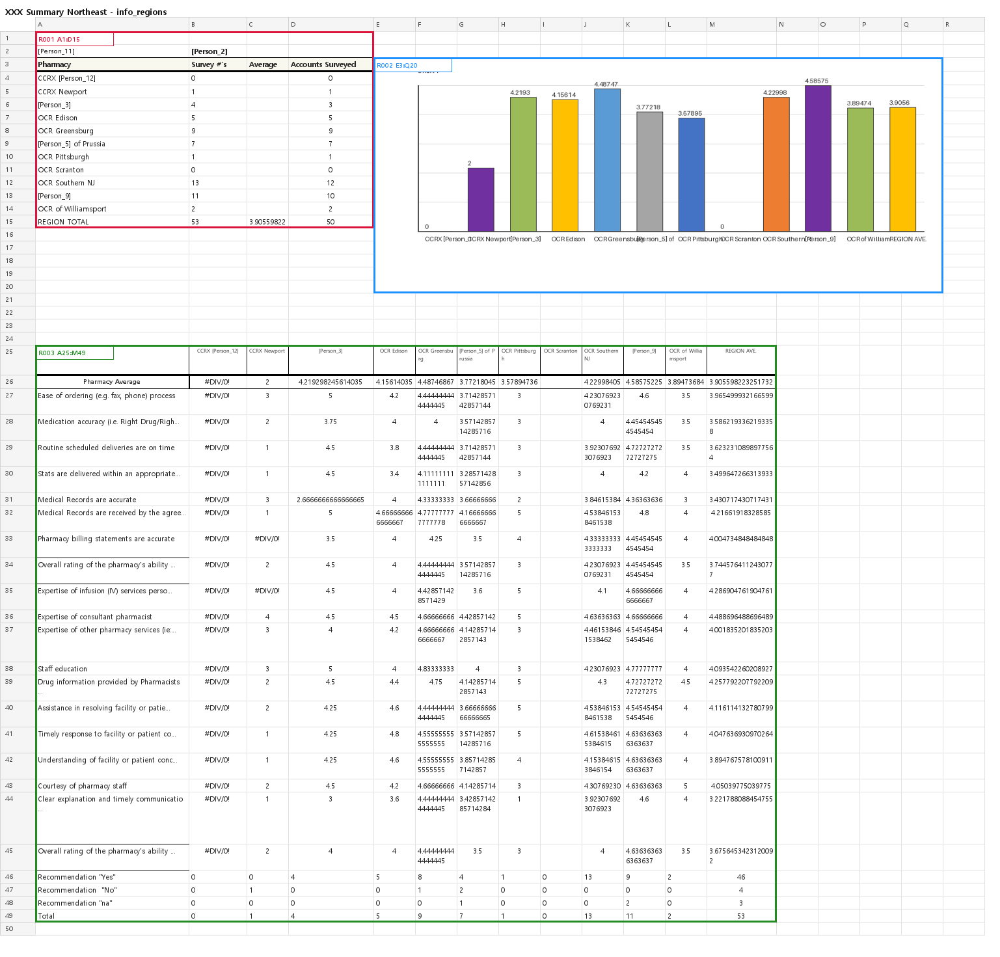
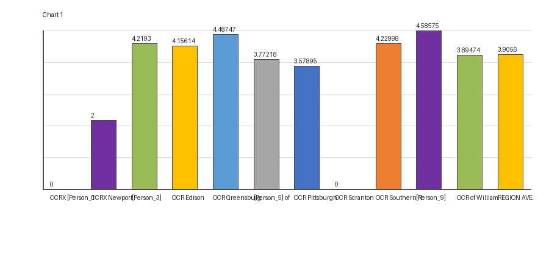

# Excel Region Extractor

Extract rectangular information regions from Excel workbooks and return them as range strings such as `A1:D10`.

The extractor uses cell values, merged cells, borders, embedded image anchors, and chart anchors. It can write sheet JSON, workbook summary JSON, optional overlay PNGs, extracted embedded image files, and simple chart preview PNGs.

## Install

```powershell
pip install excel-region-extractor
```

Install directly from GitHub:

```powershell
pip install git+https://github.com/LampSeeker/ExcelRegionExtractor.git
```

For local development:

```powershell
pip install -e .
```

## CLI Usage

Run on your workbook:

```powershell
excel-regions --workbook path/to/workbook.xlsx --out outputs/regions
```

Run one sheet:

```powershell
excel-regions --workbook path/to/workbook.xlsx --sheet "Sheet1" --out outputs/sheet1
```

Skip overlay PNG generation:

```powershell
excel-regions --workbook path/to/workbook.xlsx --out outputs/regions --no-images
```

`excel-info-regions` is kept as a backward-compatible alias.

## Python API

```python
from excel_info_region import extract_workbook_info_regions
from excel_info_region.config import load_config

config = load_config("config/default.json")
result = extract_workbook_info_regions("path/to/workbook.xlsx", config=config)
```

For writing JSON, overlay PNGs, and extracted images:

```python
from excel_info_region import run_and_write

run_and_write("path/to/workbook.xlsx", out_dir="outputs/regions")
```

## Demo

The source repository includes a synthetic, non-sensitive workbook:

```powershell
excel-regions --workbook examples/synthetic_demo.xlsx --out outputs/demo
```

Example overlay:


Chart demo:

```powershell
excel-regions --workbook examples/chart.xlsx --sheet "XXX Summary Northeast" --out outputs/chart_demo
```

Chart overlay:



Extracted chart preview:



## Output

```text
outputs/chart_demo/
  info_regions_full.json
  info_regions_summary.json

  XXX Summary Northeast/
    info_regions.json
    info_regions.png
    charts/
      CHART001_E3_Q20_Chart_1.png
```

Sheet JSON:

```json
{
  "sheet_name": "XXX Summary Northeast",
  "regions": [
    "A1:D15",
    "E3:Q20",
    "A25:M49"
  ],
  "images": [],
  "charts": [
    {
      "name": "Chart 1",
      "kind": "BarChart",
      "range_ref": "E3:Q20",
      "path": "charts/CHART001_E3_Q20_Chart_1.png",
      "sources": [
        {
          "role": "cat",
          "range_ref": "B25:M25",
          "cached_values": ["CCRX [Person_12]", "CCRX Newport", "..."]
        },
        {
          "role": "val",
          "range_ref": "B26:M26",
          "values": [["=AVERAGEIF(B27:B45,\">0\")", "..."]],
          "cached_values": [0.0, 2.0, 4.219298245614035, "..."]
        }
      ]
    }
  ]
}
```

`regions` is the list of detected Excel ranges. `images` records embedded image metadata. `charts` records chart metadata, source ranges, cached chart values when available, and a preview PNG path.

## How It Works

Current extractor flow:

```text
1. Calculate working bounds from non-empty cells, merged cells, and images
2. Collect non-empty cells as occupied cells
3. Find connected components from occupied cells
4. Convert each connected component to a rectangular bbox
5. Expand bboxes with border/table shell information
6. Merge some boxes that touch the same border component
7. Add images as separate regions
8. Output range refs such as A1:D10
```

Images are intentionally kept separate from cell connected components. This avoids over-merging drawings with nearby tables.

## Configuration

Default config lives at:

```text
config/default.json
```

Common options:

```json
{
  "include_values": true,
  "include_merged_cells": true,
  "include_images": true,
  "include_grouped_drawing_images": true,
  "include_charts": true,
  "include_chart_source_values": true,
  "respect_hidden_rows_cols": false,
  "use_print_area_bounds": false,
  "use_borders": true,
  "strong_borders_only": true,
  "use_border_contact_merge": true,
  "extract_embedded_images": true,
  "embedded_image_dir": "images",
  "extract_chart_images": true,
  "chart_image_dir": "charts"
}
```

Set a font path if text is broken in overlay PNGs:

```json
{
  "visualization": {
    "font_path": "C:/Windows/Fonts/malgun.ttf"
  }
}
```

`--no-images` skips overlay PNG generation. Embedded image extraction still runs when `extract_embedded_images` is `true`.

## Project Structure

```text
src/excel_info_region/
  cli.py             console entrypoint
  runner.py          writes JSON, overlay PNG, extracted images
  extractor.py       workbook/sheet orchestration
  cells.py           cell and merged-cell occupied logic
  borders.py         border expansion and border-contact merge
  components.py      connected components and bbox helpers
  image_regions.py   image anchors to region boxes
  image_export.py    embedded image extraction
  raw_drawing.py     raw xlsx DrawingML parsing
  visualize.py       overlay PNG renderer
```

## Development

```powershell
pytest
excel-regions --workbook examples/synthetic_demo.xlsx --out outputs/demo --no-images
```

Run without `--no-images` when changing visualization or image extraction.

Private/local Excel samples are ignored:

```text
examples/sample.xlsx
examples/sample2.xlsx
```

## Notes

`openpyxl` does not calculate formulas. Overlay rendering uses `data_only=True`, so formula cells need cached values saved by Excel to show calculated results.

## License

MIT
