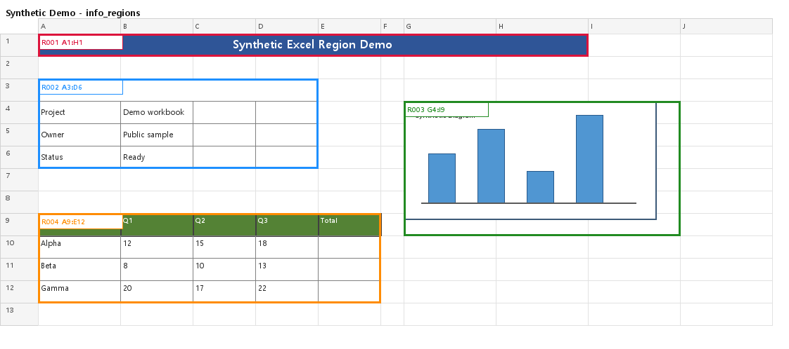

# Excel Region Extractor

Extract rectangular information regions from Excel workbooks and return them as range strings such as `A1:D10`.

The extractor uses cell values, merged cells, borders, and embedded image anchors. It can write sheet JSON, workbook summary JSON, optional overlay PNGs, and extracted embedded image files.

## Install

```powershell
pip install excel-region-extractor
```

Install directly from GitHub:

```powershell
pip install git+https://github.com/LampSeeker/ExcelRegionExtractor.git
```

For local development:

```powershell
pip install -e .
```

## CLI Usage

Run on your workbook:

```powershell
excel-regions --workbook path/to/workbook.xlsx --out outputs/regions
```

Run one sheet:

```powershell
excel-regions --workbook path/to/workbook.xlsx --sheet "Sheet1" --out outputs/sheet1
```

Skip overlay PNG generation:

```powershell
excel-regions --workbook path/to/workbook.xlsx --out outputs/regions --no-images
```

`excel-info-regions` is kept as a backward-compatible alias.

## Python API

```python
from excel_info_region import extract_workbook_info_regions
from excel_info_region.config import load_config

config = load_config("config/default.json")
result = extract_workbook_info_regions("path/to/workbook.xlsx", config=config)
```

For writing JSON, overlay PNGs, and extracted images:

```python
from excel_info_region import run_and_write

run_and_write("path/to/workbook.xlsx", out_dir="outputs/regions")
```

## Demo

The source repository includes a synthetic, non-sensitive workbook:

```powershell
excel-regions --workbook examples/synthetic_demo.xlsx --out outputs/demo
```

Example overlay:



## Output

```text
outputs/demo/
  info_regions_full.json
  info_regions_summary.json

  Synthetic Demo/
    info_regions.json
    info_regions.png
    images/
      IMG001_G4_I9_Image_1.png
```

Sheet JSON:

```json
{
  "sheet_name": "Synthetic Demo",
  "regions": [
    "A1:H1",
    "A3:D6",
    "G4:I9",
    "A9:E12"
  ],
  "images": [
    {
      "name": "Image 1",
      "range_ref": "G4:I9",
      "path": "images/IMG001_G4_I9_Image_1.png"
    }
  ]
}
```

`regions` is the list of detected Excel ranges. `images` records embedded image metadata and relative paths for extracted files.

## How It Works

Current extractor flow:

```text
1. Calculate working bounds from non-empty cells, merged cells, and images
2. Collect non-empty cells as occupied cells
3. Find connected components from occupied cells
4. Convert each connected component to a rectangular bbox
5. Expand bboxes with border/table shell information
6. Merge some boxes that touch the same border component
7. Add images as separate regions
8. Output range refs such as A1:D10
```

Images are intentionally kept separate from cell connected components. This avoids over-merging drawings with nearby tables.

## Configuration

Default config lives at:

```text
config/default.json
```

Common options:

```json
{
  "include_values": true,
  "include_merged_cells": true,
  "include_images": true,
  "include_grouped_drawing_images": true,
  "use_borders": true,
  "strong_borders_only": true,
  "use_border_contact_merge": true,
  "extract_embedded_images": true,
  "embedded_image_dir": "images"
}
```

Set a font path if text is broken in overlay PNGs:

```json
{
  "visualization": {
    "font_path": "C:/Windows/Fonts/malgun.ttf"
  }
}
```

`--no-images` skips overlay PNG generation. Embedded image extraction still runs when `extract_embedded_images` is `true`.

## Project Structure

```text
src/excel_info_region/
  cli.py             console entrypoint
  runner.py          writes JSON, overlay PNG, extracted images
  extractor.py       workbook/sheet orchestration
  cells.py           cell and merged-cell occupied logic
  borders.py         border expansion and border-contact merge
  components.py      connected components and bbox helpers
  image_regions.py   image anchors to region boxes
  image_export.py    embedded image extraction
  raw_drawing.py     raw xlsx DrawingML parsing
  visualize.py       overlay PNG renderer
```

## Development

```powershell
pytest
excel-regions --workbook examples/synthetic_demo.xlsx --out outputs/demo --no-images
```

Run without `--no-images` when changing visualization or image extraction.

Private/local Excel samples are ignored:

```text
examples/sample.xlsx
examples/sample2.xlsx
```

## Notes

`openpyxl` does not calculate formulas. Overlay rendering uses `data_only=True`, so formula cells need cached values saved by Excel to show calculated results.
